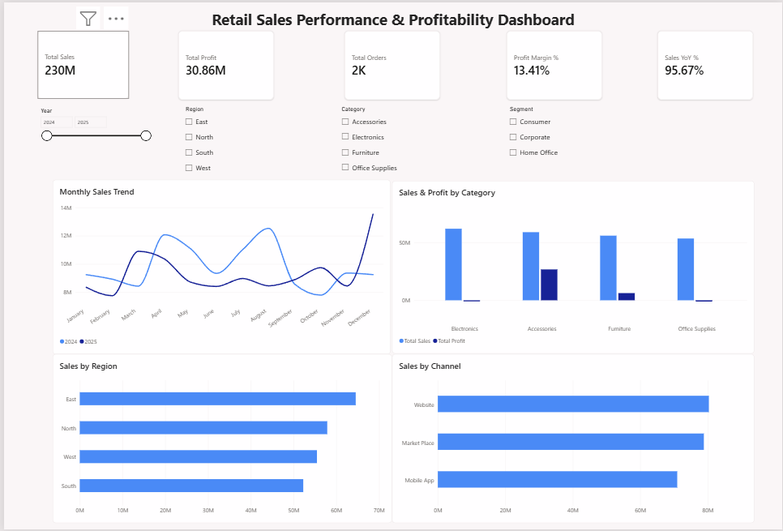
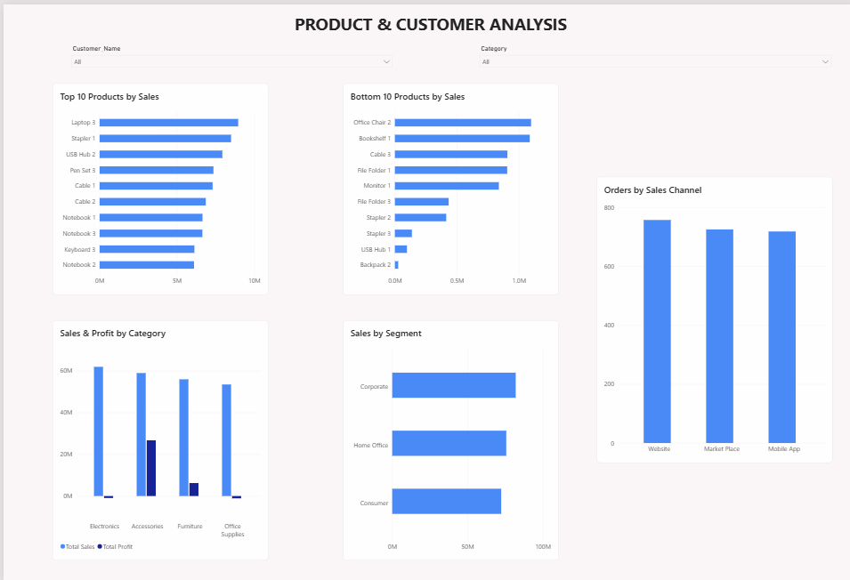
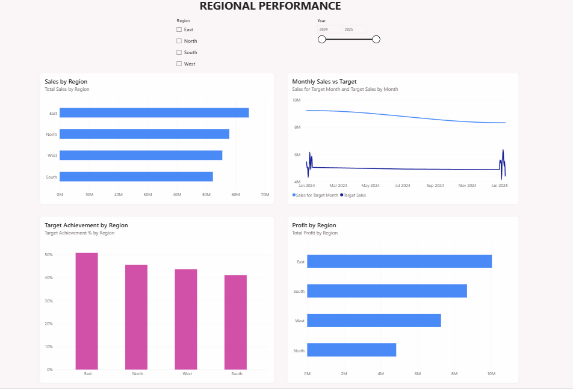

# 📊 Retail Sales Performance & Profitability Analytics

An end-to-end **Power BI analytics project** developed to analyze retail sales performance, profitability, customer behavior, product performance, regional trends, and sales target achievement across **2024–2025**.

The project covers the complete analytics workflow from **data cleaning and transformation in Power Query** to **data modeling, DAX calculations, and interactive dashboard development**.

---

## 🎯 Project Objective

The objective of this project is to transform raw retail sales data into meaningful business insights and analyze:

- Overall sales and profitability
- Monthly sales trends
- Product and category performance
- Customer segment performance
- Regional sales and profit
- Sales channel performance
- Year-over-Year (YoY) growth
- Sales target achievement

---

## 🛠️ Tools & Technologies

- Power BI
- Power Query
- DAX
- Microsoft Excel
- Data Cleaning & Transformation
- Data Modeling
- Data Visualization

---

## 🧹 Data Cleaning & Transformation

The raw Excel data was cleaned and transformed using **Power Query** before building the analytical model.

Key transformations included:

- Removed duplicate Order IDs
- Trimmed and cleaned text columns
- Standardized inconsistent categorical values
- Handled missing and null values
- Corrected data types
- Handled errors in Quantity, Discount, and Sales Amount
- Recalculated invalid Sales Amount values using business logic
- Split Product Name and Variant
- Created date-related columns
- Calculated shipping duration
- Created Order Status based on shipping time
- Cleaned Customer and Product dimension tables
- Prepared Monthly Sales Target data for analysis

For invalid Sales Amount values, sales were recalculated using:

**Sales Amount = Quantity × Unit Price × (1 - Discount)**

---

## 🗂️ Data Modeling

A **star-schema data model** was created to organize the data efficiently.

### Main Tables

- **FactSales** — Sales transaction data
- **DimCustomer** — Customer information
- **DimProduct** — Product information
- **DimDate** — Date dimension for time-based analysis
- **DimMonth** — Month-level dimension for target analysis
- **MonthlyTargets** — Monthly regional sales targets

Relationships were created between the dimension tables and FactSales to enable consistent filtering and analysis.

---

## 🧮 Key DAX Measures

The project includes DAX measures for business and performance analysis:

- Total Sales
- Total Cost
- Total Profit
- Total Orders
- Total Quantity
- Profit Margin %
- Average Order Value
- Sales Last Year
- Sales YoY %
- YTD Sales
- Target Sales
- Target Achievement %

### Example: Profit Margin

```DAX
Profit Margin % =
DIVIDE(
    [Total Profit],
    [Total Sales],
    0
)
```

### Year-over-Year Analysis

```DAX
Sales LY =
CALCULATE(
    [Total Sales],
    SAMEPERIODLASTYEAR(DimDate[Date])
)

Sales YoY % =
DIVIDE(
    [Total Sales] - [Sales LY],
    [Sales LY],
    0
)
```

---

## 📈 Dashboard Pages

### 1️⃣ Executive Sales Overview

Provides a high-level view of overall business performance.

**Key insights include:**

- Total Sales
- Total Profit
- Total Orders
- Profit Margin %
- Sales YoY %
- Monthly Sales Trend
- Sales & Profit by Category
- Sales by Region
- Sales by Channel



---

### 2️⃣ Product & Customer Analysis

Focuses on product and customer-level performance.

**Analysis includes:**

- Top 10 Products by Sales
- Bottom 10 Products by Sales
- Sales & Profit by Category
- Sales by Customer Segment
- Orders by Sales Channel
- Customer and Category filtering



---

### 3️⃣ Regional Performance

Analyzes sales and profitability across different regions.

**Analysis includes:**

- Sales by Region
- Profit by Region
- Monthly Sales vs Target
- Target Achievement % by Region
- Region and Year filtering
- Conditional formatting for below-target regions



---

## 📌 Key Business Insights

The dashboard enables users to:

- Identify top and bottom-performing products
- Compare revenue and profitability across categories
- Monitor monthly sales trends
- Analyze customer segment contribution
- Compare performance across regions
- Evaluate sales channel performance
- Track actual sales against sales targets
- Monitor Year-over-Year performance

---

## 💡 Key Learnings

Through this project, I gained hands-on experience in:

- Cleaning real-world datasets using Power Query
- Handling missing, duplicate, and erroneous data
- Designing a star-schema data model
- Creating calculated tables and measures using DAX
- Understanding filter context and relationships
- Implementing time-intelligence calculations
- Comparing actual performance against business targets
- Designing interactive and business-focused Power BI dashboards

---

## 📂 Repository Contents

- Power BI `.pbix` report
- Retail sales source dataset
- Dashboard screenshots
- `README.md` project documentation

---

## 🚀 Future Improvements

- Enhance drill-through functionality for detailed product analysis
- Refine target-vs-actual analysis
- Add dynamic tooltips
- Improve dashboard navigation and user experience

---

## 👤 Author

**Arya Kadukar**

Recent graduate interested in **Data Analytics, Business Analytics, Product Analytics, and data-driven decision-making**.
